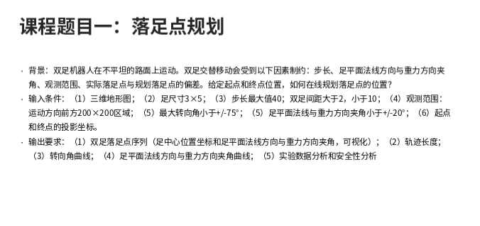
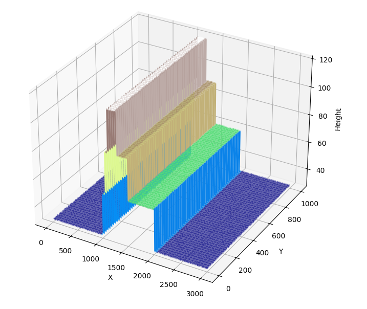

# Biped Planner

## 作业要求整理


*图1：作业要求截图*

作业要求比较模糊。将要求整理后，我们在这个项目中实际需要完成的是：

1. 训练一个模型，用来分步地给出从起点到终点的落足点序列（主要任务）
2. 模型输出的可视化与分析工具

模型每一步的输入至少需要包括：

1. 运动方向前方200x200区域地形的表示
2. 起点和终点位置的表示

模型的每一步输出应该是：

1. 下一步落足点的表示，落足点必须满足给定限制条件。

## 场景建模

作业数据中给出了三维地图：


*图2：要求高程图*

这是一个3000x1000的地图，其中颜色表示高度，高度是离散的。地图给定，但起点和终点可以变化。

我首先想到的是，既然地图是离散的，那么干脆把最关键的落足点也建模成离散的，每一个落足点表示为：

1. $x,1\leq x\leq 3000$
2. $y,1\leq y\leq 1000$
3. $h$，由$x,y$唯一确定
4. 左/右足
5. 角度

问题来了，如果角度是离散的话，就只能取东南西北4个方向，那每个转向角都是$90^\circ$，不满足转向角限制。所以转向角必须是连续建模的，而如果转向角是连续的，那前进方向也一定是连续的，“观测范围：前进方向前方200x200区域“该如何建模？观测区域的边界会切割网格，需要插值高度值，既然如此，干脆完全采用连续建模：

1. 每个落足点表示为$(x,y,\theta, \text{footside})$，其中$x\in[0,3000],y\in[0,1000],\theta\in [0,2\pi)$，$\text{footside}\in\{\text{left},\text{right}\}$
2. 地图$h(x,y)$，其中$x,y,h$都连续取值，双线性插值
3. 步长限制：$\sqrt{(x_{t+1}-x_t)^2+(y_{t+1}-y_t)^2+(h(x_{t+1},y_{t+1})-h(x_t,y_t))^2} \leq 40$
4. 双足间距限制：$2\leq \sqrt{(x_{t+1}-x_t)^2+(y_{t+1}-y_t)^2}\leq 10$，且两个旋转长方体不能重叠
5. 运动方向为上一步的落足点方向$\theta_{t-1}$
6. 最大转向角限制：$\lvert \theta_{t+1}-\theta_t \rvert \leq 75^\circ$
7. 起点和终点的投影坐标为$(0,y_s),(3000,y_g)$

    - 状态：$(x,y,\theta,\text{footside})$
    - 动作：$(dx,dy,d\theta)$
    - 观测：200x200高度图 + 起点/终点在局部坐标系的投影

8. 足平面法线限制（简化处理）：$\lvert \arctan(\frac{\partial h}{\partial x}\cos\theta + \frac{\partial h}{\partial y}\sin\theta)\rvert \leq 20^\circ$，由于地图本来就是插值出来的，再做一次近似和简化：$\frac{\partial h}{\partial x} \approx \frac{h(x+1,y)-h(x-1,y)}{2}$，$\frac{\partial h}{\partial y} \approx \frac{h(x,y+1)-h(x,y-1)}{2}$，从而可以方便地用代码处理。不过，实际将地形可视化后：

*图3：地形图*

相比30高差的阶梯，其他地块内部基本可以视为平面，但是高斯噪声又容易造成局部的特别大的坡度，很容易超过20度，因此计划把这个限制去掉。你很难想象一个能跨上30cm阶梯的双足机器人会因为1,2cm的小突起带来的坡度就坏掉了，但是这个机器人的双足的尺度确实又是～1cm这个尺度的（高差30,足尺寸3x5），只能说很奇葩了

## 文件结构

```file structure
biped-planner/
├── main.py                 # Entry point - simple demo
├── src/
│   ├── environment.py      # Core environment
│   ├── terrain.py          # 3000x1000 height map
│   ├── planner.py          # Model wrapper
│   └── visualize.py        # Assignment-required visualizations
├── data/
│   └── terrain_map.npy     # The 3000x1000 height map
└── configs/
    └── config.yaml         # Configuration file
```

## 进度

- [x] **地形处理** (`src/terrain.py`): 实现3000x1000高度图加载和双线性插值，`get_height(x,y)`查询坐标高度，`get_terrain()`返回地形类
- [x] **环境实现** (`src/environment.py`)：连续状态动作，限制检查（奖励函数还比较粗糙），可视化。
- [] **模型设计** (`src/planner.py`)
- [] **可视化与分析** (`src/visualize.py`)
